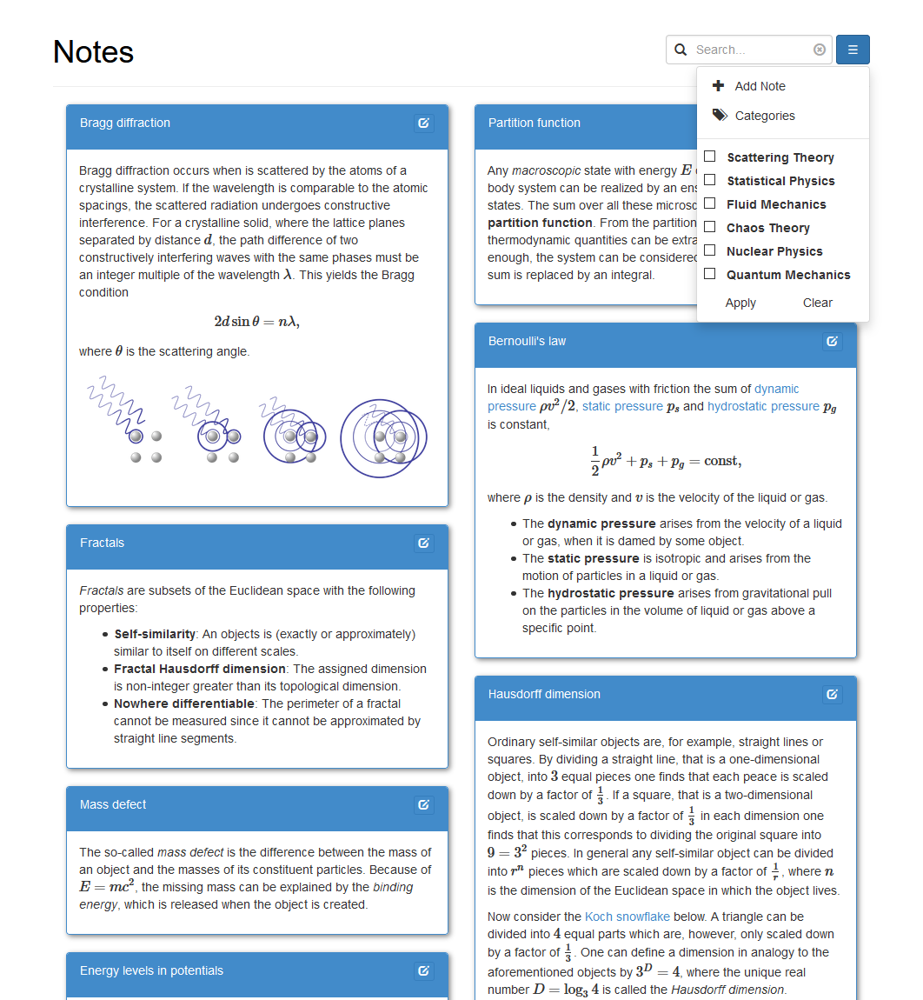
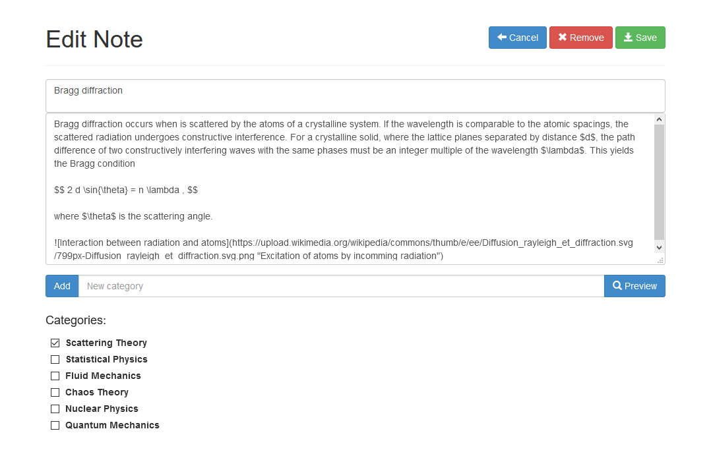

A simple web app for keeping scientific notes

Notes
=====

The notes app is written in python completely using `Flask`_ and `peewee`_ and utilising `Bootstrap 3`_ including the wonderful Glyphicon Halflings set kindly provided by `Glyphicons`_. You can use markdown and LaTeX for formatting notes, which is powered by `python-markdown`_, `python-markdown-math`_ and `MathJax`_. The alignment of notes and the ability to scroll notes continuously are made possible by `Masonry`_ and `Infinite Scroll`_.

.. _Flask: https://palletsprojects.com/p/flask/
.. _peewee: http://docs.peewee-orm.com/
.. _Bootstrap 3: https://getbootstrap.com/docs/3.3/
.. _Glyphicons: https://www.glyphicons.com/
.. _python-markdown: https://python-markdown.github.io/
.. _python-markdown-math: https://pypi.org/project/python-markdown-math/
.. _MathJax: https://www.mathjax.org/
.. _Masonry: https://masonry.desandro.com/
.. _Infinite Scroll: https://infinite-scroll.com/

Install
-------

The simple way is just to install the requirements locally:

.. code-block:: bash

    pip install --user -r requirements.txt

However, it is advisable to setup a proper `virtual environment`_ instead.

.. _virtual environment: https://docs.python.org/3/library/venv.html

Acknowledgements
----------------

This app is based on Charles Leifer's note app:

- `Blog entry 1`_
- `Blog entry 2`_

.. _Blog entry 1: http://charlesleifer.com/blog/saturday-morning-hack-a-little-note-taking-app-with-flask/
.. _Blog entry 2: http://charlesleifer.com/blog/saturday-morning-hacks-adding-full-text-search-to-the-flask-note-taking-app/
